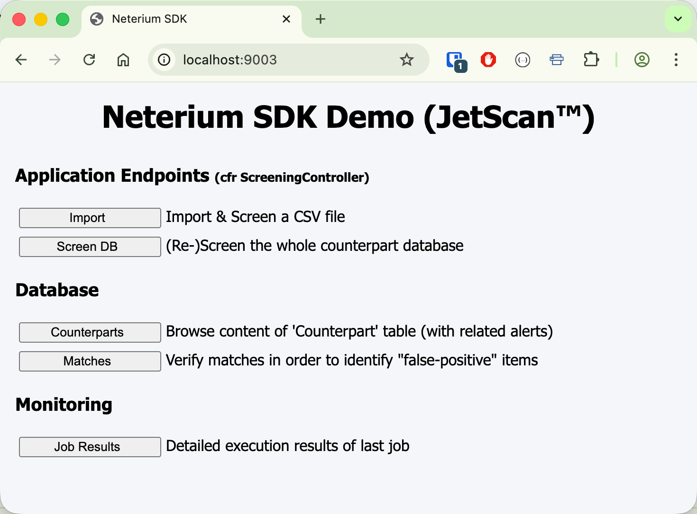
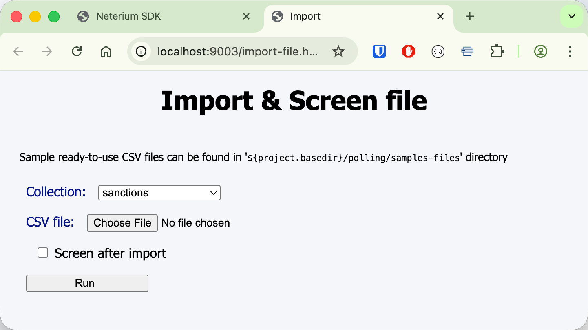
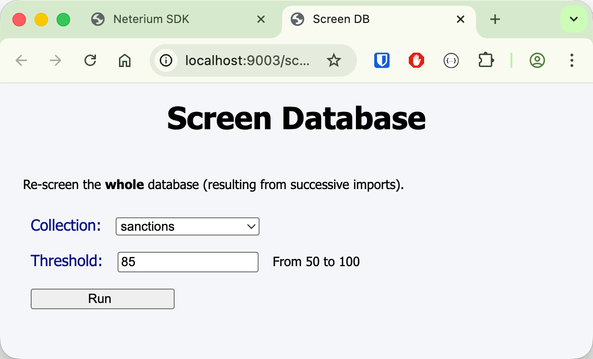
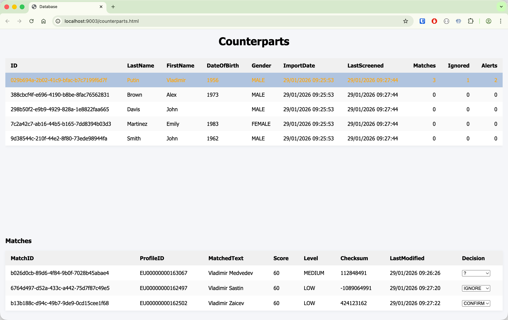
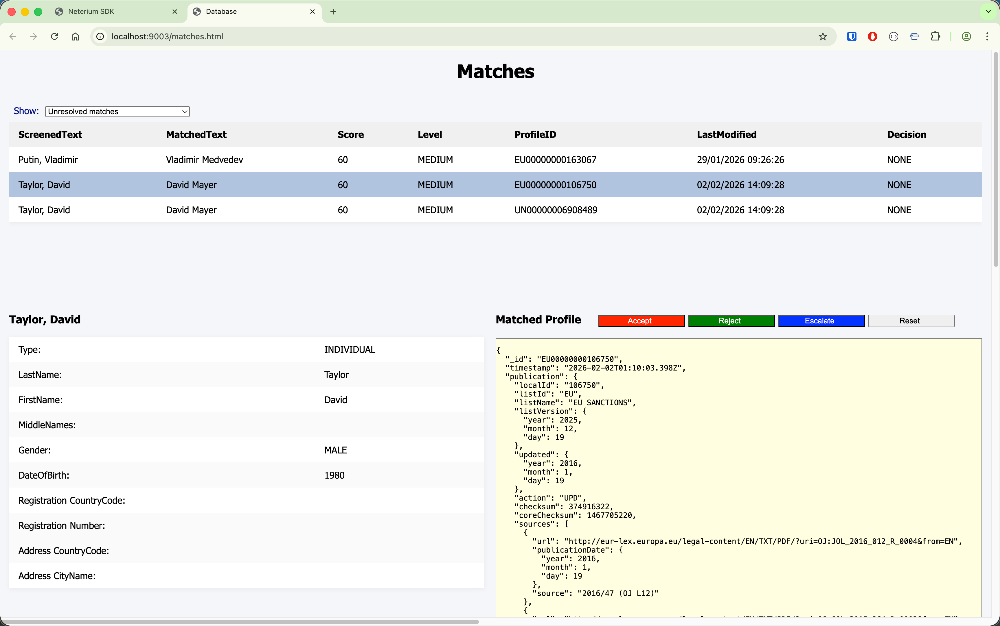
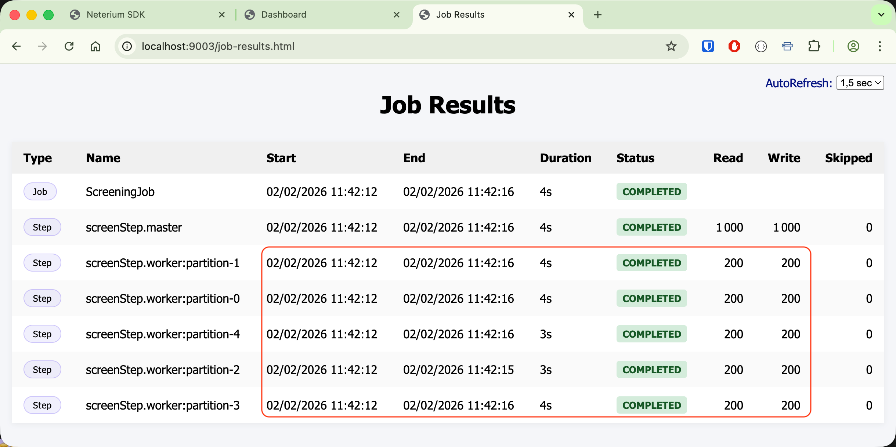

# Neterium SDK Samples : sdk-demo-name-screening

This sample application illustrates a basic web application for **name** screening and alert management,
implementing the standard end-to-end business workflow associated with name-screening operations, such as:

- import input CSV file(s) into a counterpart database
- screen (or re-screen) the complete portfolio (db) of counterparts, and store screening results
- browse counterparts along with potential found matches
- persist decision on reviewed matches

This application also exhibits the following specific characteristics:

- using almost all components of the SDK to support its workflow activities.
- being a good example of how to efficiently perform screening (eg using partitioning, batching, throttling)
- showing how to use `MatchVerifier` for hit handling

## Pre-requisites

A good knowledge of

- [Spring Batch](https://spring.io/projects/spring-batch)
- [Spring Data MongoDB](https://spring.io/projects/spring-data-mongodb)

is recommended to understand the source code.

## Build

Please refer to the documentation in the [parent](../README.md) module to learn how to build the samples apps.

## Configure

- Create an `.env` file based on provided [template](../template.env)
- Edit the file to put your credentials

## Run

- A MongoDB server is required to run the application. You can easily start a new one via `docker`.

```sh
# Start a local MongoDB server on port 27017
docker pull mongodb/mongodb-community-server:latest
docker run --name mongodb -p 27017:27017 -d mongodb/mongodb-community-server:latest
```

If needed, update the `application.yaml` file with desired ports:

```yaml
# MongoDB
spring:
  data:
  mongodb:
    host: localhost
    port: 27017
    database: sdk-demo

# Web server
server:
  port: 9003
```

- Start the application

```shell
java -jar target/sdk-demo-name-screening*.jar --spring.profiles.active=jetscan
```

### Step 1

Open your browser at http://localhost:9003 (or appropriate port)



### Step 2

You can import new counterpart files into the database, using CSV files of the following format:

```
RecordId,Type,LastName,FirstName,MiddleNames,Gender,DateOfBirth,RegistrationCountry,RegistrationNumber,AddressCountry,AddressCity
388cbcf4f-e696-4190-b8be-8fac76562831,INDIVIDUAL,Brown,Alex,,MALE,1973,BE,,,
298b50f2-e9b9-4929-828a-1e8822faa665,INDIVIDUAL,Davis,John,,MALE,,FR,,,
```

Data files can be imported in two different ways:

Either via the "**Import**" page:



Or by dropping CSV file(s) into the [polling](./polling) folder, which is polled on a regular basis,
see `application.yaml`:

```yaml
neterium:
  polling:
    directory: ./polling
    interval: 30s
```

Ready to use sample input files are provided [here](./polling/sample-files).

### Step 3

Run the screening on the whole counterpart database, using the "**Screen DB**" option



NB: Make sure to put a low threshold value (50 or 60) to increase the probability of getting matches

### Step 4

To analyze the screening results, two distinct approaches are available, depending on the perspective
adopted when navigating the parent–child relationship between the Counterpart and Match entities.

- Option#1 (Counterpart → Matches) : browse counterparts, and view matches of selected counterpart



- Option#2 (Matches → Counterpart) : put main focus on matches, and view corresponding counterpart for selected
  match



In all cases, a level-1 operator is required to take an explicit disposition action,
choosing one of the following options:

- confirm the hit (*Accept*)
- dismiss the hit (*Reject*)
- Escalate the case to a level-2 operator or an external case-management system (*Escalate*)

Also note that such decisions (confirm or dismiss candidate match) will be automatically reapplied
after a new screening process is relaunched, meaning decisions are not lost between successive
screening executions.

### Miscellaneous

In the event you would like to better understand the internals of the application, in particular
the _throughput_ optimization, we encourage you to carefully examine the **Job Results** screen
which is showing you how SpringBatch is first partitioning the initial workload to divide the execution 
into smaller work units.

For instance, with the following configuration

```yaml
neterium:
  partitioning:
    width: 5

  throttling:
    calibration:
      initial-value: 5
      max-value: 12

  screening:
    batch-size: 200
```

we can see the at timestamp **02/02/2026 11:42:12**, five screening threads were spawned concurrently.
The workload was evenly partitioned, with each thread assigned a collection of 200 records, collectively covering
the full dataset of 1.000 records. Given a fixed batch size of 200 records per request, each thread issued exactly one
API call to process its assigned dataset:




