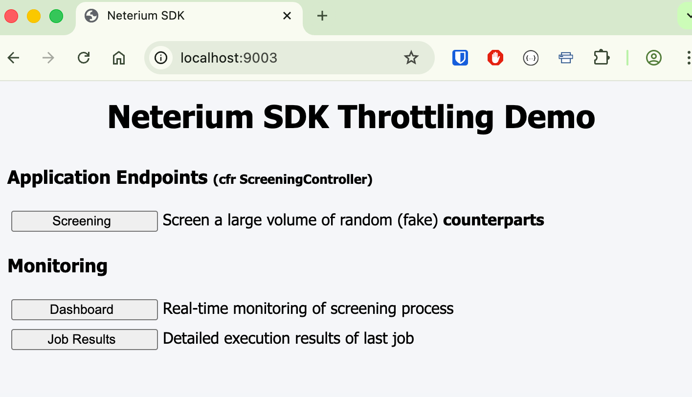
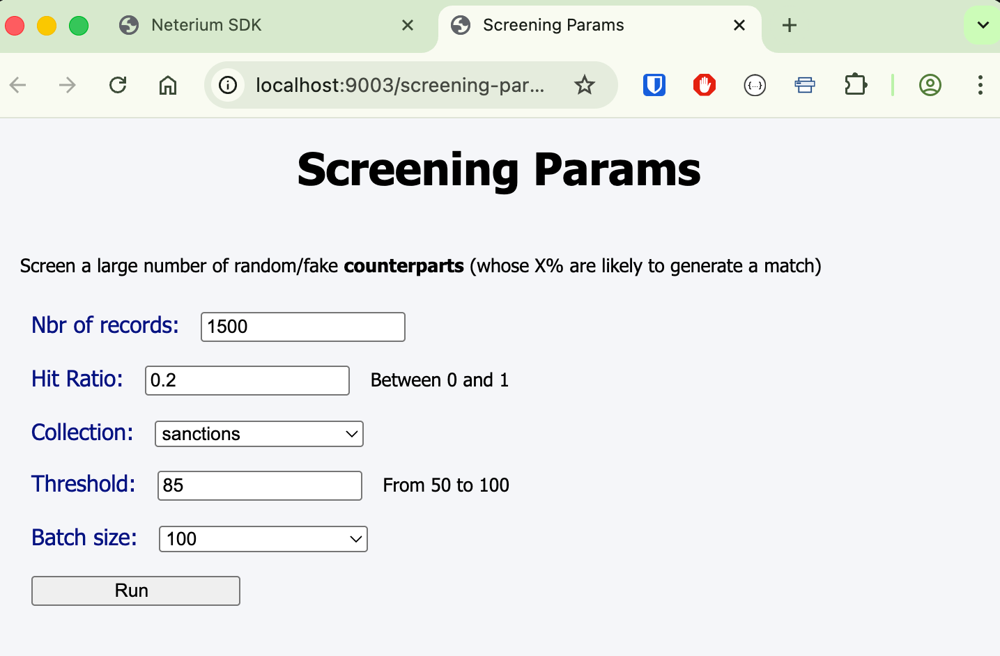
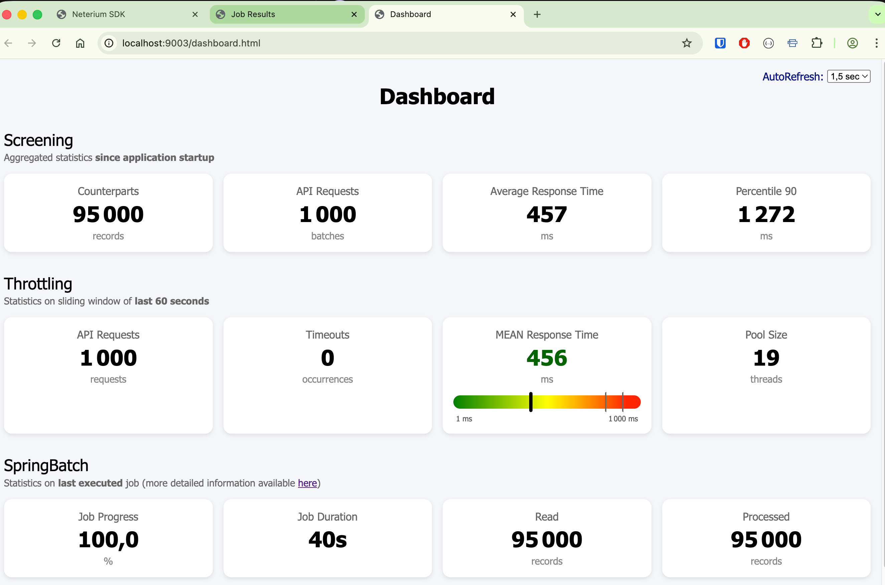
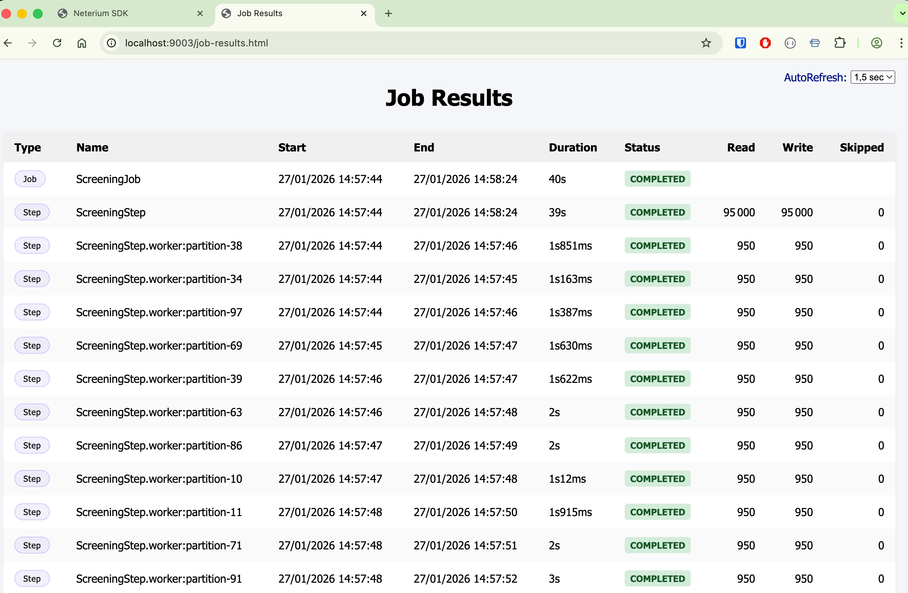

# Neterium SDK Samples : sdk-demo-throttling-web

This application is similar to the [standalone](../standalone/README.md) version, except that

- it embeds a small web server with a graphical user interface
- it relies on **Spring Batch** to start jobs (in this case screening jobs) that are potentially
  processing large volumes of records.

Its main interest, compared to the standalone version, is that it provides

- a web page to grab the value of some input parameters, such as batch-size, screening threshold, etc...
- some visual widgets that are reflecting the state and the inner functioning of the throttling mechanism
- a summary of the data partitioning that is performed internally by Spring Batch in order to improve the
  parallelism capabilities.

## Pre-requisites

A good knowledge of [Spring Batch](https://spring.io/projects/spring-batch)  framework is recommended to
understand the source code.

## Build

Please refer to the documentation in the [parent](../../README.md) module to learn how to build the samples apps.

## Configure

- Create an `.env` file based on provided [template](../../template.env)
- Edit the file to put your credentials

## Run

- If needed, change the configured port of the web server

**application.yaml**

```yaml
server:
  port: 9003
```

- Start the web application

```shell
# Name screening mode (jetscan)
java -jar target/sdk-demo-throttling*.jar --spring.profiles.active=jetscan

# Transaction screening mode (jetflow)
java -jar target/sdk-demo-throttling*.jar --spring.profiles.active=jetflow
```

- Open your browser at http://localhost:9003 (with appropriate port)



- Select the "**Screening**" menu, set your parameters, and click the "**Run**" button



- While job is running in background, go back to home page, select the "**Dashboard**" menu,
  and examine the various widgets that are evolving in a real-time:



- Use the "**Job Results**" menu to follow job execution (by Spring Batch):



## Additional notes

In the event you are using this sample application to find an _ideal_ thread pool size
(meaning the number of concurrent requests that can be sent simultaneously to Neterium server),
be aware that the more screening threads you enable
(via `neterium.throttling.calibration.max-value` config property), the more you need to also increase

- the pool size of the underlying http client
  (via `neterium.http-client.pool-size` config property) to handle the increasing number of
  concurrent http requests
- the database pool size of SpringBatch datasource
  (via `spring.datasource.hikari.maximum-pool-size` config property) to handle the increasing
  number of running job step workers.
